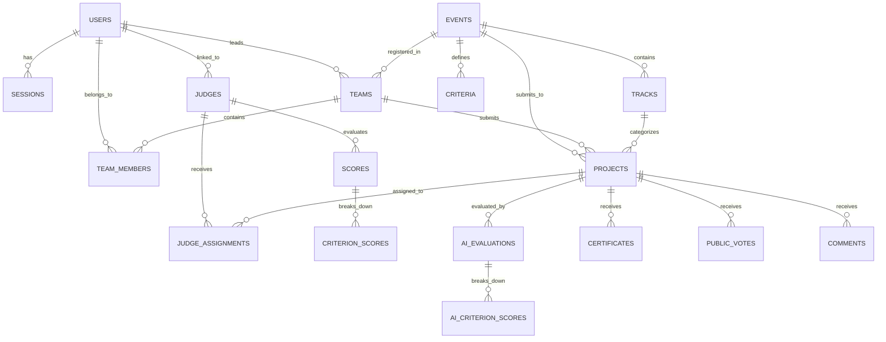

# DOGFOOD Data Model & Relational Schema

This document details the database schema, relational constraints, indexing strategy, and input/output data pipelines for the DOGFOOD Hackathon Platform.

---

## 1. Entity-Relationship Diagram



---

## 2. Table Definitions

### 2.1 `users`
Represents all system actors with local credential storage and RBAC roles.
- `id` (TEXT, PK): Unique identifier (e.g. `usr_organizer`, `usr_judge_a`).
- `username` (TEXT, UNIQUE, NOT NULL): Normalized lowercase handle.
- `email` (TEXT, UNIQUE, NOT NULL): User email address.
- `password_hash` (TEXT, NOT NULL): Salted PBKDF2-HMAC-SHA256 hash formatted as `salt_hex:hash_hex`.
- `full_name` (TEXT, NOT NULL): Display name.
- `role` (TEXT, NOT NULL): Checked against `('admin', 'organizer', 'judge', 'participant')`.
- `created_at` (TEXT, NOT NULL): UTC ISO-8601 timestamp.

### 2.2 `sessions`
Local token-based state table.
- `token` (TEXT, PK): 192-bit cryptographic random hex token or pre-seeded test session.
- `user_id` (TEXT, FK -> users.id, ON DELETE CASCADE).
- `created_at` (TEXT, NOT NULL).
- `expires_at` (TEXT, NULLABLE).

### 2.3 `events`
Hackathon lifecycle instance.
- `id` (TEXT, PK): e.g. `evt_01`.
- `name` (TEXT, NOT NULL): e.g. `Sample Hack 2026`.
- `description` (TEXT).
- `submissions_close` (TEXT, NOT NULL): Deadline timestamp in UTC ISO-8601 format. Used by the backend submission guard.
- `is_archived` (INTEGER DEFAULT 0): Toggle for read-only archival.
- `results_published` (INTEGER DEFAULT 0): Public results visibility flag.

### 2.4 `tracks`
Challenge tracks for thematic grouping and judge assignment affinity.
- `id` (TEXT, PK): e.g. `trk_01`.
- `event_id` (TEXT, FK -> events.id, ON DELETE CASCADE).
- `name` (TEXT, NOT NULL): e.g. `Developer Tools`.
- `description` (TEXT).

### 2.5 `judges`
Reviewer registry with track preferences.
- `id` (TEXT, PK): e.g. `jdg_01`.
- `user_id` (TEXT, FK -> users.id, ON DELETE SET NULL).
- `name` (TEXT, NOT NULL): Reviewer name.
- `email` (TEXT, NOT NULL).
- `tracks_json` (TEXT DEFAULT '[]'): JSON array of preferred track IDs.

### 2.6 `teams`
Participant collectives.
- `id` (TEXT, PK): e.g. `tm_01`.
- `event_id` (TEXT, FK -> events.id, ON DELETE CASCADE).
- `name` (TEXT, NOT NULL): e.g. `Nightshift`.
- `invite_code` (TEXT, UNIQUE, NOT NULL): Unique alphanumeric token (e.g. `INV-TM_01-NIG`).
- `leader_id` (TEXT, FK -> users.id).
- `created_at` (TEXT, NOT NULL).

### 2.7 `team_members`
Team membership and roles.
- `id` (TEXT, PK).
- `team_id` (TEXT, FK -> teams.id, ON DELETE CASCADE).
- `user_id` (TEXT, FK -> users.id, ON DELETE SET NULL).
- `email` (TEXT, NOT NULL).
- `name` (TEXT).
- `role` (TEXT DEFAULT 'member'): `leader` or `member`.
- `joined_at` (TEXT, NOT NULL).

### 2.8 `projects`
Hackathon project submissions.
- `id` (TEXT, PK): e.g. `prj_01`.
- `event_id` (TEXT, FK -> events.id, ON DELETE CASCADE).
- `team_id` (TEXT, FK -> teams.id, ON DELETE CASCADE).
- `track_id` (TEXT, FK -> tracks.id, ON DELETE SET NULL).
- `title` (TEXT, NOT NULL): e.g. `Glass Signal`.
- `summary` (TEXT): One-line summary.
- `problem_statement` (TEXT): Specific problem being solved.
- `description` (TEXT): Architecture and implementation details.
- `technologies` (TEXT): Comma-separated tech stack.
- `repo_url` (TEXT): Code repository link.
- `demo_url` (TEXT): Live interactive demonstration link.
- `submitted_at` (TEXT, NOT NULL): Submission timestamp.
- `eligibility_status` (TEXT DEFAULT 'approved'): `pending`, `approved`, `rejected`.
- `eligibility_notes` (TEXT).

### 2.9 `criteria`
Configurable scoring rubric dimensions.
- `id` (TEXT, PK): e.g. `crit_functionality`.
- `event_id` (TEXT, FK -> events.id, ON DELETE CASCADE).
- `key` (TEXT, NOT NULL): Dimension identifier (e.g. `functionality`, `innovation`, `quality`).
- `name` (TEXT, NOT NULL).
- `weight` (REAL DEFAULT 1.0): Multiplier in weighted average.
- `max_score` (REAL DEFAULT 5.0): Maximum allowable rating.
- `description` (TEXT).

### 2.10 `judge_assignments`
Explicit mapping of judges to projects.
- `id` (TEXT, PK).
- `judge_id` (TEXT, FK -> judges.id, ON DELETE CASCADE).
- `project_id` (TEXT, FK -> projects.id, ON DELETE CASCADE).
- `assigned_at` (TEXT, NOT NULL).
- `UNIQUE(judge_id, project_id)`.

### 2.11 `scores` & `criterion_scores`
Individual evaluations and dimension breakdown.
- `scores`: `(id, judge_id, project_id, total_score, comment, submitted_at, updated_at)`
- `criterion_scores`: `(id, score_id, criterion_key, score)`

### 2.12 `ai_evaluations`
Structured multi-dimension evaluations emitted by the AI Judge.
- `id` (TEXT, PK): e.g. `ai_eval_prj_01`.
- `project_id` (TEXT, FK -> projects.id, ON DELETE CASCADE, UNIQUE).
- `model_name` (TEXT, NOT NULL): e.g. `Dogfood-AI-Judge-v2.0`.
- `overall_score` (REAL, NOT NULL): Weighted score from 1.0 to 5.0.
- `reasoning` (TEXT, NOT NULL): Comprehensive evaluation rationale.
- `strengths_json` (TEXT, NOT NULL): Serialized JSON array of verified strengths.
- `improvements_json` (TEXT, NOT NULL): Serialized JSON array of actionable recommendations.
- `concerns_json` (TEXT, NOT NULL): Serialized JSON array of risks or gaps.
- `missing_info_json` (TEXT, NOT NULL): Serialized JSON array of missing evidence.
- `evaluated_at` (TEXT, NOT NULL): UTC ISO-8601 timestamp.

### 2.13 `ai_criterion_scores`
Fine-grained dimension breakdown for AI evaluations.
- `id` (TEXT, PK): e.g. `ai_cs_ai_eval_prj_01_technical_implementation`.
- `ai_eval_id` (TEXT, FK -> ai_evaluations.id, ON DELETE CASCADE).
- `criterion_key` (TEXT, NOT NULL): `technical_implementation`, `innovation`, `problem_relevance`, `impact`, `usability`.
- `score` (REAL, NOT NULL): Dimension rating (1.0 to 5.0).
- `weight` (REAL, NOT NULL): Multiplier weight.
- `reasoning` (TEXT): Dimension-specific analytical justification.
- `UNIQUE(ai_eval_id, criterion_key)`.

### 2.14 `audit_logs`
Chronological ledger of mutations.
- `id` (TEXT, PK).
- `user_id` (TEXT).
- `action` (TEXT NOT NULL): e.g. `SCORE_SUBMIT`, `ELIGIBILITY_UPDATE`.
- `entity_type` (TEXT).
- `entity_id` (TEXT).
- `details` (TEXT).
- `created_at` (TEXT NOT NULL).

### 2.13 `certificates`
Cryptographically verifiable credentials.
- `id` (TEXT, PK).
- `cert_code` (TEXT, UNIQUE NOT NULL): e.g. `CERT-DF-2026-WIN-01`.
- `user_id` (TEXT).
- `recipient_name` (TEXT NOT NULL).
- `type` (TEXT NOT NULL): `participant`, `judge`, `winner`.
- `event_name` (TEXT NOT NULL).
- `award_title` (TEXT).
- `project_title` (TEXT).
- `issued_at` (TEXT NOT NULL).

---

## 3. Data Pipelines (In and Out)

### Ingestion from `fixtures.json`
`src/seed_data.py` inspects the fixture JSON payload on startup and populates:
1. `event` -> `events` table
2. `tracks` -> `tracks` table
3. `judges` -> `judges` table + corresponding `users` accounts
4. `teams` -> `teams` & `team_members` tables
5. `projects` -> `projects` table
6. `scores` -> `scores` and `criterion_scores` tables + automatic `judge_assignments`

### Export Paths
1. **CSV Export** (`GET /api/export.csv`):
   Protected endpoint generating a comma-delimited export:
   ```csv
   Rank,Project ID,Project Title,Team Name,Track,Raw Score,Normalized Score,Review Count,Status
   1,prj_01,Glass Signal,Nightshift,Accessibility,4.12,4.352,3,approved
   ...
   ```
2. **REST API JSON** (`GET /api/results`):
   Structured JSON payload for external consumers and automated CI/CD runners.
